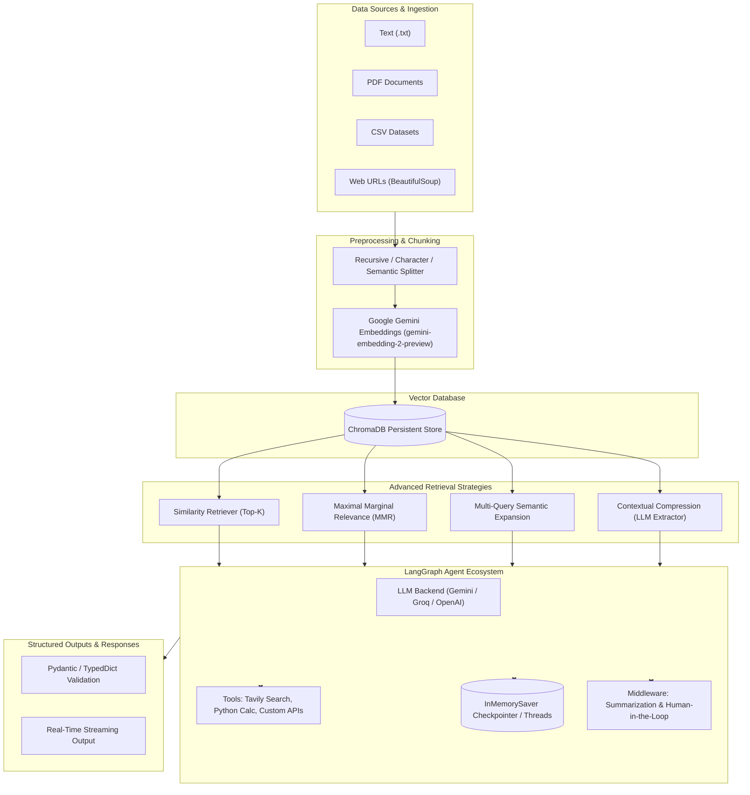

# 🥋 NinjaHatori: Generative AI & LangChain Masterclass

<div align="center">


**A comprehensive, production-grade masterclass repository covering modern Generative AI, LangChain 1.x, LangGraph Agent architectures, LCEL, RAG, Vector Databases, and Advanced Retrieval strategies.**

[✨ Features](#-key-highlights) • [🗺️ Curriculum Roadmap](#-curriculum-matrix) • [🏗️ Architecture](#%EF%B8%8F-system-architecture) • [🚀 Quickstart](#-getting-started) • [📚 Module Walkthrough](#-detailed-module-breakdown) • [🔒 Security](#-security--best-practices)

</div>

---

## 🌟 Key Highlights

- **Multi-Provider LLM Integration**: Seamless orchestration between **Google Gemini (3.5 Flash / Flash-Lite)**, **Groq Cloud (GPT-OSS-20B / LLaMA)**, and **OpenAI**.
- **Autonomous & Multi-Tool Agents**: State graph agents using `langgraph` with tool binding, dynamic function calling, and multi-step reasoning.
- **Web-Grounded Intelligence**: Real-time web search grounding via **Tavily AI Search Engine**.
- **Enterprise-Grade Agent Middleware**:
  - 🔄 **Summarization Middleware**: Message-based and token-threshold-triggered context compression.
  - 🛑 **Human-in-the-Loop (HITL) Middleware**: Interactive workflow pausing for human **Approve**, **Edit**, and **Reject** commands using `langgraph.types.Command`.
- **Typed & Structured Outputs**: Schema validation using **Pydantic v2**, **TypedDict**, and **DataClasses**.
- **Conversational Memory**: Multi-tenant state persistence with thread-isolated `InMemorySaver` checkpointers.
- **Modern LCEL (LangChain Expression Language)**: Sequential, parallel (`RunnableParallel`), passthrough (`RunnablePassthrough`), lambda transformations (`RunnableLambda`), and conditional routing (`RunnableBranch`).
- **End-to-End RAG Pipelines**:
  - Document loaders (PDF, CSV, TXT, WebBaseLoader with BeautifulSoup).
  - Chunking strategies (Character, Recursive, Language-specific AST splitting, Semantic Chunker).
  - Persistent Vector Store (ChromaDB + Gemini Embeddings).
  - Advanced Retrievers: **MMR (Maximal Marginal Relevance)**, **Multi-Query Semantic Expansion**, and **Contextual LLM Compression**.

---

## 🗺️ Curriculum Matrix

| # | Module / Notebook | Key Technologies & Concepts | Difficulty |
|---|-------------------|-----------------------------|:----------:|
| **01** | [`1-langchain_introduction.ipynb`](generativeai/1-langchain_introduction.ipynb) | `init_chat_model`, Gemini & Groq APIs, Streaming (`.stream()`), Batching (`.batch()` with `max_concurrency`) | 🟢 Beginner |
| **02** | [`2-tools.ipynb`](generativeai/2-tools.ipynb) | Custom `@tool` decorators, JSON schemas, `bind_tools`, manual tool execution loop, `ToolMessage` | 🟢 Beginner |
| **03** | [`3-agents_intro.ipynb`](generativeai/3-agents_intro.ipynb) | `create_agent` (LangGraph), Autonomous function calling, compiled state graphs | 🟡 Intermediate |
| **04** | [`4-multiple_agents.ipynb`](generativeai/4-multiple_agents.ipynb) | `TavilySearch` web tool + Math Calculator, multi-tool agent routing, streaming values | 🟡 Intermediate |
| **05** | [`5-messages.ipynb`](generativeai/5-messages.ipynb) | `SystemMessage`, `HumanMessage`, `AIMessage`, `ToolMessage`, metadata tracing, token usage | 🟢 Beginner |
| **06** | [`6-structured_output.ipynb`](generativeai/6-structured_output.ipynb) | `with_structured_output`, Pydantic validation, nested schemas, `TypedDict`, `dataclass` | 🟡 Intermediate |
| **07** | [`7-memory.ipynb`](generativeai/7-memory.ipynb) | `InMemorySaver` checkpointer, state persistence, thread-isolated conversational memory (`thread_id`) | 🟡 Intermediate |
| **08** | [`8-middleware.ipynb`](generativeai/8-middleware.ipynb) | `SummarizationMiddleware` (token & message triggers), `HumanInTheLoopMiddleware` (Approve/Edit/Reject) | 🔴 Advanced |
| **09** | [`9-chains.ipynb`](generativeai/9-chains.ipynb) | LCEL pipe operator `|`, Sequential pipelines, Parallel note/quiz generation, Conditional sentiment routing | 🟡 Intermediate |
| **10** | [`10-Runnables.ipynb`](generativeai/10-Runnables.ipynb) | `RunnableSequence`, `RunnableParallel`, `RunnablePassthrough`, `RunnableLambda`, `RunnableBranch` | 🟡 Intermediate |
| **11** | [`document_loaders/11-document_loaders.ipynb`](generativeai/document_loaders/11-document_loaders.ipynb) | `TextLoader`, `PyPDFLoader`, `DirectoryLoader`, `lazy_load()` generators, `WebBaseLoader`, `CSVLoader` | 🟢 Beginner |
| **12** | [`12-text_splitting.ipynb`](generativeai/12-text_splitting.ipynb) | `CharacterTextSplitter`, `RecursiveCharacterTextSplitter`, Code splitting (`Language.PYTHON`), `SemanticChunker` | 🟡 Intermediate |
| **13** | [`13-vector_stores.ipynb`](generativeai/13-vector_stores.ipynb) | `Chroma` Vector Store, `GoogleGenerativeAIEmbeddings`, disk persistence, top-$k$ similarity search | 🟡 Intermediate |
| **14** | [`14-retrievers.ipynb`](generativeai/14-retrievers.ipynb) | `WikipediaRetriever`, `VectorStoreRetriever`, `MMR`, `MultiQueryRetriever`, `ContextualCompressionRetriever` | 🔴 Advanced |

---

## 🏗️ System Architecture



---

## 🚀 Getting Started

### 1. Prerequisites
- **Python 3.13+** installed.
- Package manager: [`uv`](https://github.com/astral-sh/uv) (recommended for ultra-fast dependency resolution) or standard `pip`.

### 2. Clone the Repository
```bash
git clone https://github.com/venkataganesh22/GENAI-LangChain.git
cd GENAI-LangChain
```

### 3. Environment Configuration
Duplicate `.env.example` into a new `.env` file:
```bash
cp .env.example .env
```
Populate `.env` with your API keys:
```env
# Google AI Studio: https://aistudio.google.com/app/apikey
GOOGLE_API_KEY=your_google_gemini_api_key_here

# Groq Cloud: https://console.groq.com/keys
GROQ_API_KEY=your_groq_api_key_here

# Tavily AI Search: https://tavily.com/
TAVILY_API_KEY=your_tavily_api_key_here

# OpenAI (Optional): https://platform.openai.com/api-keys
OPENAI_API_KEY=your_openai_api_key_here
```

> [!CAUTION]
> Never commit `.env` containing your real API keys. The `.gitignore` is already pre-configured to protect your secrets.

### 4. Install Dependencies

**Using `uv` (Recommended):**
```bash
uv sync
```

**Using `pip`:**
```bash
python -m venv .venv
# On Windows:
.venv\Scripts\activate
# On Linux/macOS:
source .venv/bin/activate

pip install -r requirements.txt
```

### 5. Launch Jupyter Notebooks
```bash
jupyter lab
# or
jupyter notebook
```
Navigate to `generativeai/` and open any notebook to begin learning!

---

## 📚 Detailed Module Breakdown

<details>
<summary><b>📖 Module 01: LangChain Core & Multi-Provider Invocations</b></summary>

- Universal model initialization with `init_chat_model("google_genai:gemini-3.5-flash-lite")` and `init_chat_model("groq:openai/gpt-oss-20b")`.
- **Progressive Streaming**: Using `.stream()` to yield output chunks in real time.
- **Parallel Batching**: `.batch()` with custom `max_concurrency` to fire parallel queries at maximum throughput.
</details>

<details>
<summary><b>🛠️ Module 02 & 03: Tools & Autonomous Agents</b></summary>

- Converting custom Python functions into LLM tools using `@tool` with type hints and docstring descriptions.
- Model tool binding with `model.bind_tools([get_weather])`.
- Step-by-step tool execution loop: LLM generates tool call arguments $\rightarrow$ Python executes tool $\rightarrow$ `ToolMessage` passed back to LLM $\rightarrow$ Final synthesized response.
- Compiling stateful autonomous agents with `langchain.agents.create_agent`.
</details>

<details>
<summary><b>🌐 Module 04: Multi-Tool & Web Search Agents</b></summary>

- Integrating **Tavily AI Search Engine** for real-time web browsing and information retrieval.
- Binding multiple tools simultaneously (e.g., live web search + exact mathematical calculator).
- Visualizing step-by-step reasoning and tool calls using `.stream(stream_mode="values")`.
</details>

<details>
<summary><b>💬 Module 05: Message Architecture & Metadata</b></summary>

- Deep dive into `SystemMessage` (role conditioning), `HumanMessage` (user query / multimodal input), `AIMessage` (model responses), and `ToolMessage` (tool outputs).
- Message metadata inspection: Tracing token usage (`input_tokens`, `output_tokens`, `reasoning_tokens`), model provider fingerprints, and response timing.
</details>

<details>
<summary><b>📦 Module 06: Structured Outputs & Validation</b></summary>

- Guaranteeing schema adherence using `.with_structured_output(...)`.
- **Pydantic v2**: Type enforcement, default values, nested objects (e.g., Movie containing a list of `Actor` objects), and descriptive validation.
- **TypedDict & Annotated**: Lightweight schema specification with metadata descriptions.
- **DataClasses**: Python standard `@dataclass` bindings.
</details>

<details>
<summary><b>🧠 Module 07: Conversational Memory & Multi-Turn State</b></summary>

- Stateful agents powered by `InMemorySaver`.
- Multi-user thread isolation using `config = {"configurable": {"thread_id": "session_id"}}`.
- Maintaining persistent context across multiple turns without leaking state between sessions.
</details>

<details>
<summary><b>🛡️ Module 08: Agent Middleware (Summarization & Human-in-the-Loop)</b></summary>

- **SummarizationMiddleware**:
  - Message-count triggers: Automatically compresses history when exceeding $N$ messages while keeping recent turns intact.
  - Token-fraction triggers: Summarizes history when context window reaches defined percentage thresholds.
- **HumanInTheLoopMiddleware**:
  - Halts execution for critical operations (e.g., sending emails, database modifications).
  - Inspects `__interrupt__` payload with action requests.
  - Resumes execution using `Command(resume={"decisions": [{"type": "approve" | "reject" | "edit"}]})`.
</details>

<details>
<summary><b>🔗 Module 09 & 10: LCEL Chains & Runnables</b></summary>

- Composing pipelines using the pipe operator: `chain = prompt | model | parser`.
- **Sequential Chains**: Cascading outputs from one LLM as input into another (e.g., Report Generator $\rightarrow$ Executive Summarizer).
- **RunnableParallel**: Firing multiple LLM workflows concurrently and merging outputs into unified documents.
- **RunnableBranch & RunnableLambda**: Conditional branching (e.g., Sentiment classification $\rightarrow$ Positive response handler vs Negative response handler).
- **RunnablePassthrough**: Forwarding original inputs alongside transformed values.
</details>

<details>
<summary><b>📄 Module 11 & 12: Document Loaders & Chunking Strategies</b></summary>

- Loading diverse file types: `TextLoader` (.txt), `PyPDFLoader` (.pdf), `CSVLoader` (.csv), and `WebBaseLoader` (.html).
- Memory-efficient streaming with `lazy_load()` for massive datasets.
- Chunking strategies:
  - `CharacterTextSplitter`: Length-based chunking with customizable overlap.
  - `RecursiveCharacterTextSplitter`: Hierarchy-based splitting (`\n\n` $\rightarrow$ `\n` $\rightarrow$ ` ` $\rightarrow$ character).
  - Code-aware splitting: `RecursiveCharacterTextSplitter.from_language(Language.PYTHON)`.
  - `SemanticChunker`: Embedding-distance boundary detection for semantic coherence.
</details>

<details>
<summary><b>🗄️ Module 13 & 14: Chroma Vector Store & Advanced Retrieval</b></summary>

- Embedding documents using Google's `gemini-embedding-2-preview` model.
- Building, persisting, and querying **ChromaDB** vector collections.
- **Retrieval Strategies**:
  - **Maximal Marginal Relevance (MMR)**: Balancing relevance with diversity using `lambda_mult`.
  - **Multi-Query Retriever**: Using an LLM to generate multiple semantic variations of a query for superior recall.
  - **Contextual Compression Retriever**: Applying `LLMChainExtractor` to strip away irrelevant text from retrieved chunks before sending to the generator.
  - **External API Retrievers**: Querying live knowledge bases via `WikipediaRetriever`.
</details>

---

## 🔒 Security & Best Practices

1. **Keep Secrets Secret**: Never commit `.env` or hardcode API keys in notebooks. Use `dotenv.load_dotenv()` and fetch via `os.getenv()`.
2. **Deterministic Outputs in Production**: Set `temperature=0` when performing classification, extraction, or structured data tasks.
3. **Context Window Optimization**: Leverage `SummarizationMiddleware` and `ContextualCompressionRetriever` to reduce token consumption and latency.
4. **Human Oversight**: Use `HumanInTheLoopMiddleware` whenever an agent executes external writes, deletions, or financial transactions.

---

## 👤 Author & Maintainer

- **Author**: Venkata Ganesh
- **Email**: [venkataganeshguthi@gmail.com](mailto:venkataganeshguthi@gmail.com)
- **GitHub**: [@venkataganesh22](https://github.com/venkataganesh22)

---

